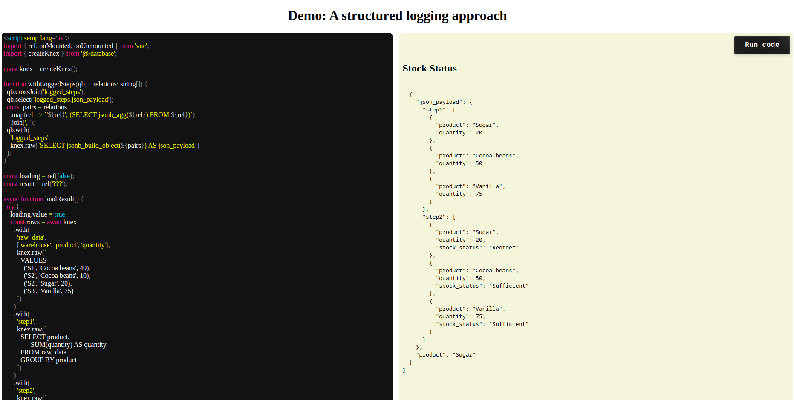

# Debugging Complex SQL (Demo)

For [Debugging Complex SQL Queries: A Structured Logging Approach](https://kunzite.cc/debugging-complex-sql-queries-structured-logging)

## Technologies used

- [x] [Vite](https://vite.dev/)

- [x] [PGLite](https://github.com/electric-sql/pglite)

- [x] [Knex](https://github.com/knex/knex)

  * [x] [knex-pglite](https://github.com/czeidler/knex-pglite)

- [x] [`@vue/repl` v4]( https://github.com/vuejs/repl)

  * It uses iframes, kinda makes it hard to share state.

  * I couldn't find an easy to import my custom script (`database.js`), so I decided to use something else.

- [x] `vue-live` https://github.com/vue-styleguidist/vue-live

  * It renders the component to the current page's DOM.
    Meaning, if we use global state, we need to 

---

END.
